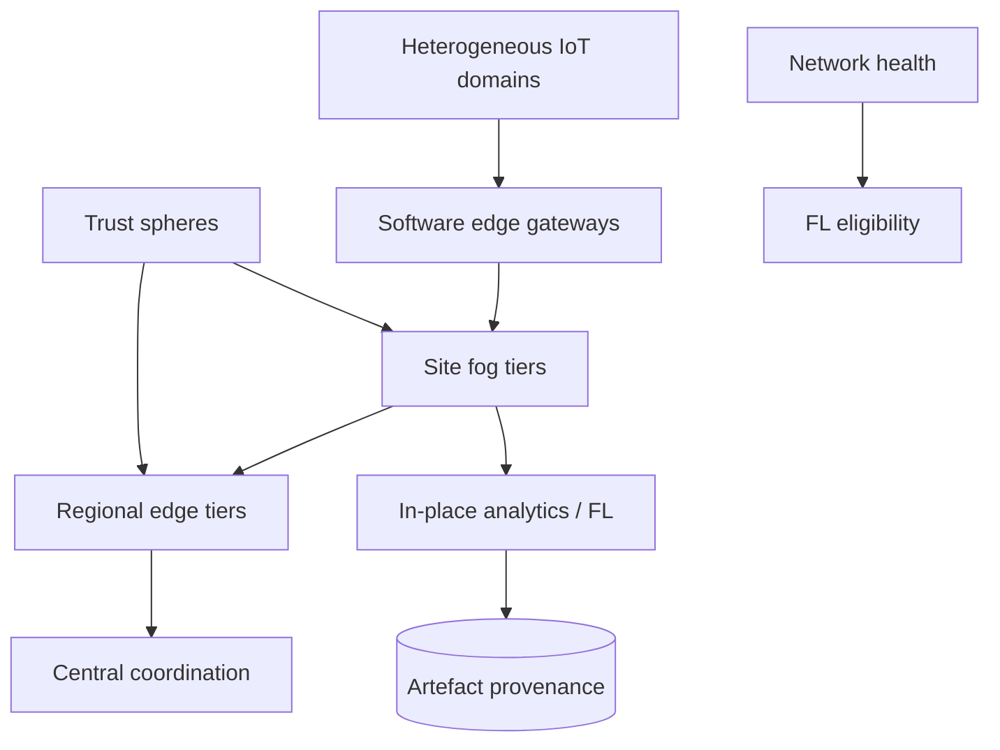

# Tierfog

**Source:** `ai-in-decentralized+ai/muraliiot-edge-ai-networks-180601042020/`
**Domain:** `ai-decentralized`
**One-liner:** A multi-tier edge/fog networking fabric that converges heterogeneous IoT protocols into hierarchical federated-analytics nodes so intelligence runs in place — with trust, authenticity, and data addressing as first-class controls.
**Wedge:** Industrial IoT and smart-infrastructure operators drowning in protocol silos (MQTT, CoAP, Zigbee, 6loWPAN/RPL, BT mesh, V2X) who need federated learning/analytics at the edge without building a custom gateway per radio.
**Positioning:** Huawei NFV-CC edge/IoT federated-learning networking. Murali Rangachari’s deck sizes the IoT deluge (e.g. 4,000 GB/day per self-driving car; 1,000,000 GB/day connected factories), contrasts dumb-sensor history with intelligent ARM nodes, surveys mesh/RPL/6loWPAN realities, rejects simple gateways as non-scalable silos, and reframes Edge as relative hierarchical decision nodes for federated analytics — challenges: trust/transparency/traceability, federated compute, federated learning platforms, federated data addressing. Tierfog productises that fabric — distinct from Rimcast (single-path latency placement) and Denselink (phone mesh density).

## Market research synthesis

### Thesis from source

The deck opens with IoT market explosion figures (McKinsey $11.1T by 2025; multi-source device and revenue forecasts) and argues the storm is already here: operators must manage billions of devices and a data deluge (1.5 GB/day average user; 3,000 GB/day smart hospitals; 4,000 GB/day per AV; 40,000 GB/day aircraft; 1,000,000 GB/day factories). Device evolution moved from PLC/SCADA dumb sensors to cheap ARM/SoC intelligent nodes. Protocol diversity is extreme — HTTP/WebSockets for rich devices, V2X stacks, MQTT/CoAP/OPC-UA/DDS/AMQP for IIoT, Zigbee/BT5/6loWPAN for constrained radios — and lossy low-power meshes need RPL-style DODAGs rather than classic OSPF.

The strategic turn: “So many protocols — how do we converge?” Custom gateways create silos and cannot keep up with evolving radios. Edge Cloud is relative (cloud provider PoP vs enterprise branch vs phone vs vehicle vs building floor). Federated analytics follows: data and intelligence are distributed; multi-layered edge/fog/cloud must analyse in place; virtual data & analytics fabric; challenges explicitly list trust/transparency/traceability (security), federated compute frameworks, federated learning platforms, and federated data addressing. Networking for FL at the edge must itself be deployed as a cloud: gateways to RPL/BT mesh and high-throughput video, distributed data platforms for in-place analytics, multi-tier edge/fog compute (replication or MPI), HPC tools for distributed platforms. Tierfog is the operator control plane for that hierarchical fabric.

### Buyer & economic model

- **Primary buyer:** Head of IoT Platform / Edge Infrastructure at an industrial, municipal, or mobility operator.
- **Users:** network engineers, edge SRE, FL/ML platform teams, security architects, site OT leads, capacity planners.
- **Budget owner / value metric:** share of analytics executed in-place (not backhauled); mean time to onboard a new radio protocol domain; trust incidents on edge nodes.
- **Competing status quo:** per-protocol hardware gateways, central data lakes choking on GB/day feeds, and FL experiments that ignore networking constraints.

### Domain constraints

- **Regulatory / trust / safety:** OT safety, vehicle and hospital environments, authentication spheres of influence across cascaded edges.
- **Data sensitivity:** local analytics must minimise raw exfiltration; federated data addressing must not become a global PII index.
- **Change-management realities:** brownfield radios stay; Tierfog adds edge-cloud gateways and policy, not a rip-and-replace of Zigbee bulbs.

## Business requirements

- BR-1: The fabric must onboard multiple device-network types (at minimum IP-rich, MQTT/CoAP-class, and 6loWPAN/RPL or BT mesh-class) through configurable edge gateways without a unique appliance SKU per protocol forever.
- BR-2: Edge nodes must be modellable as hierarchical tiers (device → site fog → regional edge → cloud) with explicit parent/child decision roles.
- BR-3: Analytics and FL tasks must default to in-place execution at the lowest tier that meets policy, measuring backhaul volume avoided.
- BR-4: Trust controls must authenticate nodes and establish spheres of influence before a tier may join federated compute.
- BR-5: Federated data addressing must resolve datasets by reference across tiers without requiring central raw copies.
- BR-6: Transparency/traceability logs must show which tier produced which analytic artefact for audit.
- BR-7: High-throughput channels (e.g. video) and low-power meshes must be schedulable on the same site fabric with isolation policies.
- BR-8: Gateway configs must be software-updatable as protocols evolve, avoiding frozen custom hardware silos called out in the deck.
- BR-9: Security events (jamming, impersonation, key loss) must quarantine a tier without collapsing the entire DAG.
- BR-10: FL platform hooks must publish round participation eligibility based on network health, not only model configuration.
- BR-11: Operators must see deluge-oriented capacity planning (GB/day class estimates) per site class (hospital, factory, vehicle).
- BR-12: Commercial multi-tenant edge hosts (if used) must isolate tenant spheres of influence cryptographically and operationally.

## User stories

Canonical user stories live in sibling [USER_STORIES.md](USER_STORIES.md).

## System design

### Overview

Tierfog registers sites, tiers, and protocol domains; deploys software gateways that translate device networks into a common fabric; schedules in-place analytics and FL participation by tier policy; enforces trust spheres; and emits traceability for artefacts. Capacity views use site-class deluge models. Quarantine isolates failed tiers.

### Actors & boundaries

- **Actors:** edge engineers, OT leads, FL teams, security, capacity planners, platform operator, optional tenants.
- **Trust boundary:** fabric control plane sees metadata, health, and artefact hashes; raw OT streams stay in tier data planes per policy.
- **Human-in-the-loop points:** quarantine overrides, new protocol domain approval, cross-tier data-address grants.

### Core capabilities

1. **Protocol domain onboarding** — software gateways for heterogeneous radios/apps.
2. **Hierarchical tier registry** — device/fog/edge/cloud roles.
3. **In-place analytics scheduling** — lowest eligible tier execution.
4. **Federated learning hooks** — health-gated participation.
5. **Federated data addressing** — reference resolution across tiers.
6. **Trust spheres** — authentication and influence boundaries.
7. **Traceability ledger** — artefact provenance by tier.
8. **Quarantine and capacity planning** — isolation + GB/day views.

### Conceptual data

- **Primary entities:** Site, TierNode, ProtocolDomain, GatewayConfig, AnalyticsJob, FlRoundEligibility, DataAddress, TrustSphere, ArtefactProvenance, QuarantineEvent.
- **Critical events:** domain onboarded, tier joined, job scheduled in-place, FL eligibility granted/denied, artefact sealed, tier quarantined.
- **Retention / audit needs:** provenance and trust events for safety/security windows; raw telemetry per OT policy.

### Integrations (conceptual)

- **Systems of record:** OT historians, device management, FL training controllers, SIEM.
- **Upstream signals:** RPL/BT/MQTT/V2X networks, node health, jamming detectors.
- **Downstream actions:** gateway config push, job placement, quarantine, capacity tickets.

### High-level architecture

### Success metrics

- **Leading:** time to onboard a new protocol domain; % analytics jobs executed below regional edge; quarantine MTTR.
- **Lagging:** backhaul volume avoided; FL round failure rate due to network; trust incidents per 1,000 nodes; cost per site versus per-protocol gateway estate.

## OpenAPI skeleton

Canonical HTTP surface lives in sibling [openapi.yaml](openapi.yaml). Summary:

- **Base path:** `/v1/...`
- **Auth:** `X-API-Key` for gateways and agents; Bearer JWT for operators.
- **Resource groups:** Sites, Tiers, Domains, Jobs, Trust, Provenance.
