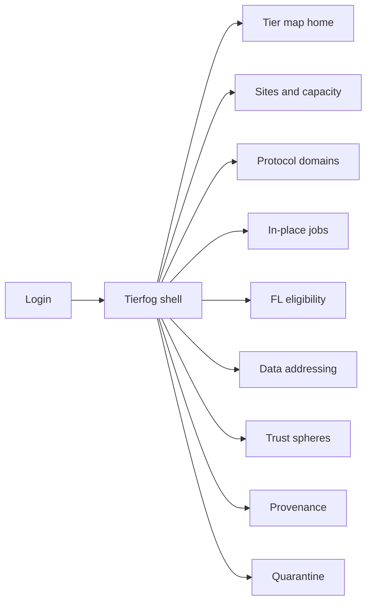
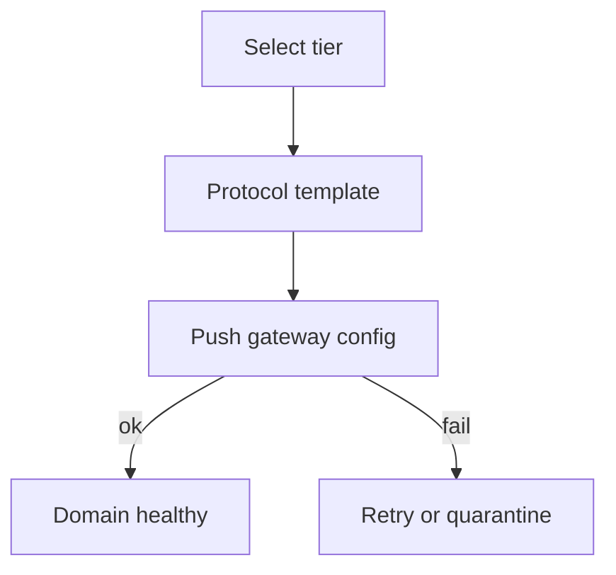

# Tierfog — Web app

**Product:** [PRODUCT.md](./PRODUCT.md)
**Primary surface:** Multi-tier edge/fog fabric operator console
**Secondary surfaces:** FL eligibility read-view for ML platforms; tenant sphere admin (multi-tenant edge hosts)
**Design thesis:** Tierfog is a hierarchical fog map — the UI metaphor is a cascaded decision tree of edges (device → site fog → regional → cloud), not a single “IoT dashboard” and not a cloud billing console. Visual language is cool mist-cyan and industrial iron on deep fog-grey: in-place jobs glow at the tier that ran them; backhauled work looks like a leak; quarantine dims a branch without collapsing the DAG. The Tierfog wordmark sits as a quiet fog-mark on every tier map so OT and SRE know whose spheres they are trusting.

## UX research synthesis

### Category peers (best-in-class)

- **AWS IoT Greengrass / Azure IoT Edge / Balena:** Hierarchical device→gateway→cloud topology and software-updatable edge runtimes. Steal: tier tree as primary nav with config push; reject per-protocol appliance catalogs as the forever model.
- **HiveMQ / EMQX control centers:** MQTT-class domain health and isolation. Steal: protocol domain cards with throughput vs constrained mesh side-by-side (BR-7).
- **Kubeflow / Flower FL dashboards (pattern):** Round participation and worker health. Steal: eligibility gated on network health, not only model config (BR-10); reject training-metric walls as the fabric home.
- **Cisco Cyber Vision / Nozomi OT security:** Zone quarantine without plant-wide collapse. Steal: tier quarantine that keeps the parent DAG alive (BR-9).

### Patterns to adopt / reject

- **Adopt:** Hierarchical tier map; software gateway onboarding for heterogeneous domains; in-place job default with backhaul-avoided metric; trust spheres before federated join; federated data addresses by reference; artefact provenance by tier; deluge capacity by site class; tenant isolation.
- **Reject:** One flat device list as home; “send everything to the lake” default; custom hardware SKU wizard as the only path; purple AI fog marketing; global cleartext PII address book; silent FL rounds when mesh is unhealthy.

### Trust, density, and workflow constraints from PRODUCT.md

Protocol convergence without forever unique appliances (BR-1, BR-8). Analytics default to lowest eligible tier (BR-3). Trust spheres before federated compute (BR-4). Federated addressing must not become a global PII index (BR-5). Traceability of which tier produced artefacts (BR-6). Quarantine isolates without collapsing the DAG (BR-9). Capacity planning uses GB/day site classes from the deck’s deluge framing (BR-11). Brownfield radios stay — Tierfog is policy and gateways, not rip-and-replace.

## Information architecture

### Nav model

### Roles → default home

| Role | Default home | Why |
|------|--------------|-----|
| Edge / IoT platform engineer | Tier map home | Hierarchy and gateway attach (BR-2) |
| OT / site lead | Sites and capacity | In-place vs backhaul at site (BR-3, BR-11) |
| FL / ML platform engineer | FL eligibility | Health-gated rounds (BR-10) |
| Security architect | Trust spheres | Authenticate before join (BR-4) |
| Capacity planner | Sites and capacity | GB/day class forecasts (BR-11) |
| Platform admin | Protocol domains | Software gateway updates (BR-8) |

### Cross-links to OpenAPI resources

| Nav area | OpenAPI tags / resources |
|----------|---------------------------|
| Sites and capacity | Sites |
| Tier map | Tiers |
| Protocol domains / gateways | Domains |
| In-place jobs | Jobs |
| Trust / quarantine | Trust |
| Artefact provenance | Provenance |

## Screen inventory

### Tier map home

- **Purpose:** Make cascaded edges explicit — vehicle as edge of city hub; devices as edge of vehicle.
- **Entry:** Engineer login default.
- **Layout regions:** Brand + site switcher; interactive DAG (device → fog → edge → cloud); health overlays; in-place vs backhaul leak indicators; quarantine-dimmed branches.
- **Primary actions:** Select tier; open domain attach; quarantine branch.
- **Empty / loading / error:** Empty = register first site; loading = DAG skeleton.
- **BR / story ties:** BR-2, BR-9; engineer stories.

### Sites and deluge capacity

- **Purpose:** Register sites with class (hospital, factory, vehicle…) and GB/day planning.
- **Entry:** Nav → Sites; capacity planner home.
- **Layout regions:** Site table; class templates with deluge estimates; fog sizing recommendation; backhaul-avoided KPI.
- **Primary actions:** Register site; set class; export capacity ticket.
- **Empty / loading / error:** Unknown class = custom estimate with warning.
- **BR / story ties:** BR-11; capacity planner stories.

### Protocol domain onboarding

- **Purpose:** Attach MQTT/CoAP, IP-rich, 6loWPAN/RPL, BT mesh, etc. via software gateway config — not a new SKU forever.
- **Entry:** Nav → Domains; from tier node.
- **Layout regions:** Domain list; gateway config editor; update channel; brownfield radio notes; isolation policy vs high-throughput channels.
- **Primary actions:** Onboard domain; push config; schedule gateway software update.
- **Empty / loading / error:** Empty = pick protocol template; push fail = coral with retry.
- **BR / story ties:** BR-1, BR-7, BR-8.

### In-place analytics jobs

- **Purpose:** Schedule analytics/FL tasks at lowest tier meeting policy; measure backhaul avoided.
- **Entry:** Nav → Jobs.
- **Layout regions:** Job table; placement policy; chosen tier highlight; backhaul volume counterfactual; override with reason.
- **Primary actions:** Create job; force lower/higher tier with audit; pause job.
- **Empty / loading / error:** No eligible tier = policy explanation.
- **BR / story ties:** BR-3; OT stories.

### FL round eligibility

- **Purpose:** Publish participation eligibility from network health, not only model config.
- **Entry:** FL team default; Jobs → FL.
- **Layout regions:** Round list; health gates; eligible/denied tiers; deny reasons (mesh loss, quarantine).
- **Primary actions:** Open round; export eligibility to FL controller; waive health gate with risk note.
- **Empty / loading / error:** Unhealthy default deny — never silent assume.
- **BR / story ties:** BR-10.

### Federated data addressing

- **Purpose:** Resolve datasets by reference across tiers without central raw copies or global PII index.
- **Entry:** Nav → Addressing.
- **Layout regions:** Address catalog (refs only); grant cross-tier resolve; PII-ban checklist; never show cleartext subject directories.
- **Primary actions:** Register address; grant resolve; revoke.
- **Empty / loading / error:** PII-pattern detect = block register.
- **BR / story ties:** BR-5.

### Trust spheres

- **Purpose:** Authenticate nodes and set spheres of influence before federated compute join.
- **Entry:** Security home.
- **Layout regions:** Sphere map overlay on DAG; join requests; crypto/operational isolation status for multi-tenant hosts.
- **Primary actions:** Approve join; deny; rotate sphere keys.
- **Empty / loading / error:** Unauthenticated tier = cannot schedule federated job.
- **BR / story ties:** BR-4, BR-12.

### Artefact provenance

- **Purpose:** Show which tier produced which analytic artefact for audit/accountability.
- **Entry:** Nav → Provenance; from job result.
- **Layout regions:** Artefact list; tier path; hash; transparency log export.
- **Primary actions:** Open artefact; export audit pack.
- **Empty / loading / error:** Missing provenance = coral integrity warning.
- **BR / story ties:** BR-6.

### Quarantine controls

- **Purpose:** Isolate jammed/impersonated/key-loss tiers without collapsing the parent DAG.
- **Entry:** Alerts; Trust → Quarantine.
- **Layout regions:** Quarantine queue; affected branch preview; continue-parent confirmation; release controls.
- **Primary actions:** Quarantine; release; notify OT.
- **Empty / loading / error:** Empty = healthy fabric message.
- **BR / story ties:** BR-9; OT/security stories.

### Channel isolation policy

- **Purpose:** Schedule high-throughput video and low-power meshes on same site with isolation.
- **Entry:** Domain detail → Isolation.
- **Layout regions:** Channel classes; QoS/isolation rules; storm protection.
- **Primary actions:** Save policy; simulate contention.
- **Empty / loading / error:** Conflict = block save with explanation.
- **BR / story ties:** BR-7.

### Tenant sphere admin

- **Purpose:** Cryptographic and operational isolation on shared edge hosts.
- **Entry:** Platform admin multi-tenant mode.
- **Layout regions:** Tenant list; sphere bindings; cross-tenant deny proofs.
- **Primary actions:** Create tenant sphere; audit isolation.
- **Empty / loading / error:** Single-tenant mode hides nav.
- **BR / story ties:** BR-12.

### Gateway update center

- **Purpose:** Software-update gateways as protocols evolve — avoid frozen custom hardware silos.
- **Entry:** Domains → Updates.
- **Layout regions:** Version matrix; rollout rings; rollback.
- **Primary actions:** Stage update; promote; rollback.
- **Empty / loading / error:** Failed ring = halt promotion.
- **BR / story ties:** BR-8.

## Key flows

1. **Onboard protocol domain** — pick tier → choose template → push gateway config → health green; failure: push retry / quarantine if auth fail.

2. **In-place job** — define job → policy picks lowest tier → execute → provenance seal → backhaul-avoided metric (BR-3, BR-6).

3. **Trust join** — node authenticates → sphere assigned → eligible for federated compute (BR-4).

4. **Quarantine branch** — security event → quarantine tier → parent DAG continues → investigate → release (BR-9).

5. **FL eligibility** — round starts → health gate → eligible set published to FL controller; unhealthy denied (BR-10).

## Design system

### Tokens (CSS variables)

- `--color-ink: #E6EEF2` — primary text
- `--color-fog-950: #0B1214` — app ground
- `--color-fog-900: #121A1E` — panels
- `--color-iron: #8A969C` — secondary labels
- `--color-mist: #5AD1C7` — in-place / healthy tier (mist-cyan)
- `--color-mist-dim: #2A7A74`
- `--color-amber: #E0A12B` — backhaul leak / capacity risk
- `--color-coral: #E85D4C` — quarantine / trust deny
- `--color-brand: #9EE8E0` — Tierfog wordmark
- `--font-display: "Sora", sans-serif` — tier titles / map labels
- `--font-body: "IBM Plex Sans", sans-serif`
- `--font-mono: "IBM Plex Mono", monospace` — node ids, artefact hashes
- `--space-1`…`--space-8`: 4px scale
- `--radius-sm: 4px`; `--radius-md: 8px`
- `--motion-inplace: 200ms ease-out` — tier glow when job lands
- `--motion-quarantine: 280ms ease-in` — branch dims
- Atmosphere: soft vertical fog gradient; faint DAG grid; industrial iron hairlines — no neon purple mesh eye-candy.

### Typography & brand

- Sora for tier map titles; mono for node and artefact ids.
- Brand fog-mark left of chrome on map and trust screens.
- Login: brand hero, one headline (“Intelligence in place — across every radio”), one CTA.

### Do / don’t

- **Do:** DAG-first orientation; show backhaul avoided; quarantine without full-DAG kill; refs-only addressing; software gateway updates.
- **Don’t:** Purple AI glow; flat device bingo boards as home; lake-first defaults; PII address directories; emoji protocol badges.

### Accessibility & domain trust cues

- AA+ mist/amber/coral on fog; quarantine uses dim + “Quarantined” text + icon.
- Live regions for quarantine and FL deny events.
- Focus order: site → tier → domain → job → provenance.
- Provenance exports machine-readable for safety audits.

## Component patterns

- **TierDagMap** — hierarchical nodes with health and quarantine dimming.
- **ProtocolDomainCard** — gateway config + update channel.
- **InPlacePlacementBadge** — tier chosen + backhaul avoided.
- **FlHealthGate** — eligibility from network health.
- **DataAddressRef** — federated ref without PII expand.
- **TrustSphereOverlay** — influence boundaries on DAG.
- **ArtefactProvenancePath** — tier path + hash.
- **QuarantineBranchControl** — isolate without collapse.
- **DelugeCapacityMeter** — GB/day by site class.

## Out of scope for v1 web

- Device firmware IDE; full FL training UI (hooks only); Zigbee bulb retail apps; carrier core network OSS; native OT handheld beyond PWA alerts; Rimcast single-path placer; Denselink phone-mesh console.
